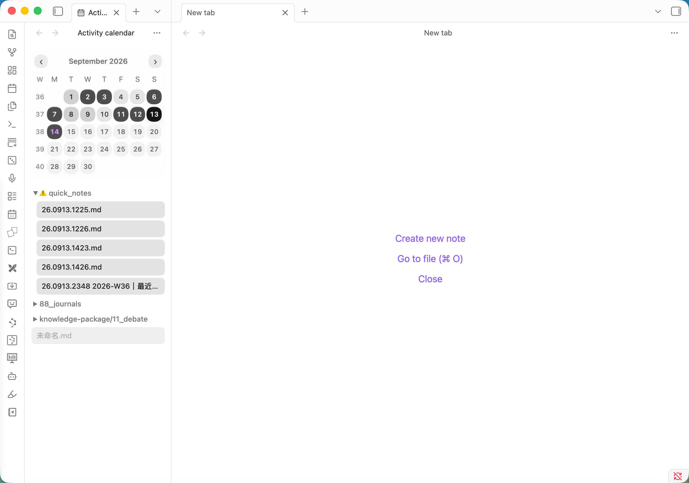

# Activity Tree Calendar

<p align="center">
  <strong>Remember the day. Rediscover the note. See your creative rhythm across the month.</strong>
</p>

<p align="center">
  <strong>English</strong> · <a href="README.zh-CN.md">简体中文</a>
</p>



## What it does

Obsidian makes it easy to find a note by name—but not to answer **“What was I working on that day?”**

Activity Tree Calendar turns your local edit history into a monthly heatmap. Pick a date and the files you edited that day appear immediately in a compact folder tree.

| 1. Scan the month | 2. Pick a date | 3. Reopen the work |
|---|---|---|
| Darker circles reveal your active days. | One click filters the list to that day. | Select any file to open it in Obsidian. |

## Why you’ll find it useful

### 1. Find notes by when, not what

You may forget a filename while still remembering **when** you worked on it—a meeting last Tuesday, a weekend trip, or a particularly productive week.
Start from the date and recover the related notes without guessing search terms.

### 2. Busy days stay organized

Editing many notes in one day does not turn into an overwhelming flat list.
Files remain grouped in a collapsible folder tree, single-child folder chains are compressed, and every note title stays separately clickable.

```text
01_Psychology/02_Life principles
  A note I edited.md
```

Whether the day contains 3 notes or 30, your familiar vault structure makes them easy to browse and find.

### 3. See your creative rhythm across the month

The calendar shows more than isolated file timestamps. Its heat levels reveal your creative frequency across the entire month—active stretches, quieter periods, and the rhythm of returning to your notes.

The darkest shade uses a fixed threshold so the visual scale stays understandable. The default is **10 edited files**, configurable from **1–100**.

## Core features

- **Monthly activity heatmap** — understand your writing rhythm at a glance.
- **Day-to-file navigation** — click a date to see and open every Markdown file edited that day.
- **Collapsible folder tree** — preserve vault structure without wasting horizontal space.
- **Sidebar-first layout** — responsive calendar, single-line titles, and ellipsis for narrow panes.
- **Automatic localization** — Chinese and English follow the current Obsidian language.
- **Local-only history** — no account, analytics, or network requests.

## Open the calendar

- Select the calendar icon in the Obsidian ribbon; or
- Run **Open activity calendar** from the command palette.

Use the arrow buttons to switch months. Select a date to filter the file tree, then select a file to open it.

## Settings

Open **Settings → Community plugins → Activity Tree Calendar**.

| Setting | Default | Purpose |
|---|---:|---|
| Darkest heat threshold | 10 files | Controls how many edited files produce the strongest heat level. |

## Language

The interface follows Obsidian automatically—there is no separate language switch inside the plugin.

- Chinese Obsidian → 简体中文
- English and other locales → English

This includes month formatting, weekdays, commands, settings, empty states, and accessibility labels.

## Installation

### From a GitHub release

1. Download `main.js`, `manifest.json`, and `styles.css` from the latest release.
2. Create `<vault>/.obsidian/plugins/activity-tree-calendar/`.
3. Copy the three files into that folder.
4. Reload Obsidian.
5. Enable **Activity Tree Calendar** under Community plugins.

## Privacy

The plugin does not make network requests. Activity history and settings stay in the local plugin data file inside your vault.

It records the paths of Markdown files when Obsidian reports create, modify, or rename events. Note contents are not copied into the activity history.

## Development

Requires Node.js 18 or later.

```bash
npm install
npm run dev
```

Production checks:

```bash
npm run build
npm run lint
```

## Release

Create a GitHub release whose tag exactly matches the plugin version without a `v` prefix. Attach:

- `main.js`
- `manifest.json`
- `styles.css`

## License

[0BSD](LICENSE)
